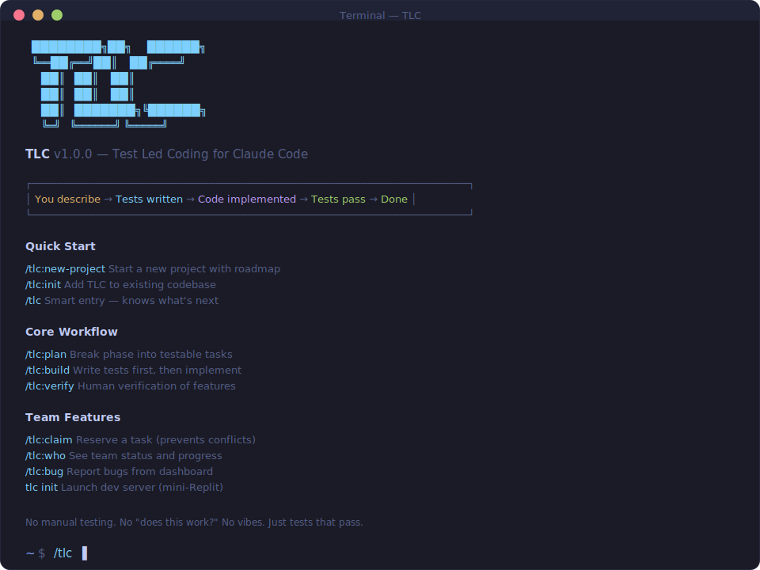

# TLC

[](https://www.npmjs.com/package/tlc-claude-code)
[](https://www.npmjs.com/package/tlc-claude-code)
[](https://opensource.org/licenses/MIT)

**Test Led Coding for Claude Code. Tests before code. Automatically.**

```bash
npx tlc-claude-code   # or just: tlc (after global install)
```

<p align="center">
  
</p>

---

## Why TLC?

You tell Claude to build something. It builds it. You test it manually. It's broken. You debug. Repeat.

**That's backwards.**

TLC writes tests *before* code exists. Every feature has a spec. Every spec is executable. When the code works, you know — because the tests pass.

```
You describe → Tests written → Code implemented → Tests pass → Done
```

No manual testing. No "does this work?" No vibes.

---

## Quick Start

### New Project

```bash
/tlc:new-project
```

### Existing Project

```bash
/tlc:init
```

### Then Just Run

```bash
/tlc
```

TLC knows where you are and what's next.

---

## Features

### For Solo Developers

- **Test-first by default** — Claude writes tests before code
- **Smart dashboard** — See progress, run actions
- **Coverage gaps** — Find and fix untested code
- **Auto-fix** — Automatically repair failing tests

### For Teams

- **Task claiming** — Prevent duplicate work across engineers
- **Bug tracking** — QA submits bugs, engineers fix them
- **Dev server** — Mini-Replit with live preview and logs
- **Issue sync** — GitHub, Jira, Linear integration

> **📄 [Team Workflow Guide](docs/team-workflow.md)** — How 3 engineers + PO + QA collaborate with TLC

### For Enterprise

- **CI/CD pipelines** — GitHub Actions, GitLab, Azure, CircleCI
- **Dev server** — Branch previews with auth & Slack webhooks
- **Multi-tool export** — Works with Cursor, Copilot, Continue, Cody

---

## Commands

| Command | What It Does |
|---------|--------------|
| `/tlc` | **Smart entry point — knows what's next** |
| `/tlc:new-project` | Start new project with roadmap |
| `/tlc:init` | Add TLC to existing codebase |
| `/tlc:build` | Write tests → implement → verify |
| `/tlc:coverage` | Find and fix untested code |
| `/tlc:quality` | Test quality scoring |
| `/tlc:autofix` | Auto-repair failing tests |

### Team Commands

| Command | What It Does |
|---------|--------------|
| `/tlc:claim` | Reserve a task |
| `/tlc:who` | See who's working on what |
| `/tlc:bug` | Log a bug |
| `tlc init` | Add Docker dev launcher to project |

### Integration Commands

| Command | What It Does |
|---------|--------------|
| `/tlc:ci` | Generate CI/CD pipeline |
| `/tlc:issues` | Sync with GitHub/Jira/Linear |
| `/tlc:export` | Export for Cursor/Copilot/etc |
| `/tlc:deploy` | Dev server deployment |

[**See all commands →**](help.md)

---

## Team Collaboration

TLC supports distributed teams with git-based coordination.

```markdown
### Task 1: Create schema [x@alice]     ← completed by alice
### Task 2: Add validation [>@bob]      ← bob is working
### Task 3: Write tests [ ]             ← available
```

```bash
/tlc:claim 2                  # Reserve task 2
/tlc:who                      # See team status
tlc init      # Add dev server launcher
# Then double-click tlc-start.bat
```

**📄 [Full Team Workflow Guide →](docs/team-workflow.md)**

---

## Dev Server

Launch a mini-Replit for your team with Docker:

```bash
# Add launcher to your project (one-time)
tlc init

# Windows: double-click tlc-start.bat
# Mac/Linux: ./tlc-start.sh
```

**What you get:**

| URL | Service |
|-----|---------|
| http://localhost:3147 | Dashboard — Live preview, logs, tasks |
| http://localhost:5001 | App — Your running application |
| http://localhost:8080 | DB Admin — Database GUI (Adminer) |
| localhost:5433 | Database — PostgreSQL |

**Features:**
- **Live preview** — Your app embedded in dashboard
- **Real-time logs** — App, tests, git activity
- **Bug submission** — Web form for QA
- **Task board** — Who's working on what
- **Multi-project** — Containers named `tlc-{project}-*` for simultaneous projects
- **Hot reload** — Code changes apply instantly (no restart needed)

**Rebuild when needed:**
```bash
tlc rebuild      # After package.json changes or to get a clean slate
```

**Requirements:** [Docker Desktop](https://www.docker.com/products/docker-desktop)

---

## Test Quality

### Quality Scoring

```bash
/tlc:quality
```

- Coverage (lines, branches, functions)
- Edge case detection
- Mutation testing score

### Edge Case Generation

```bash
/tlc:edge-cases src/auth/login.ts
```

AI-generated tests for null, boundaries, unicode, security.

### Auto-Fix

```bash
/tlc:autofix
```

Automatically repair failing tests with retry loop.

---

## Test Framework

TLC defaults to **mocha + chai + sinon + proxyquire**.

Configure in `.tlc.json`:

```json
{
  "testFrameworks": {
    "primary": "mocha",
    "installed": ["mocha", "chai", "sinon", "proxyquire"],
    "run": ["mocha"]
  }
}
```

Also supports Jest, Vitest, and others via `/tlc:config`.

---

## Architecture

```
PROJECT.md                    Project overview
.planning/
  ROADMAP.md                  Phases and progress
  BUGS.md                     Bug tracker
  phases/
    1-PLAN.md                 Phase 1 tasks
    2-PLAN.md                 Phase 2 tasks
.tlc.json                     Configuration
tlc-start.bat                 Docker dev launcher (Windows, gitignored)
```

### TLC Installation Files

```
C:\Code\TLC\                  (or your install location)
  start-dev.ps1               PowerShell launcher
  docker-compose.dev.yml      Container orchestration
  server/                     Dashboard server
```

---

## Works With

| Tool | Support |
|------|---------|
| **Claude Code** | Native (slash commands) |
| **Cursor** | Via `/tlc:export` → `.cursorrules` |
| **Google Antigravity** | Via `/tlc:export` → `.antigravity/rules.md` |
| **GitHub Copilot** | Via `/tlc:export` → `.github/copilot-instructions.md` |
| **Continue** | Via `/tlc:export` → `.continue/config.json` |
| **Cody** | Via `/tlc:export` → `.cody/instructions.md` |
| **Aider** | Via `/tlc:export` → `.aider.conf.yml` |
| **Windsurf** | Via `/tlc:export` → `.windsurfrules` |

---

## Install

```bash
# Install globally (recommended)
npm install -g tlc-claude-code

# Then use anywhere:
tlc              # Install slash commands to Claude Code
tlc init         # Add Docker launcher to project (creates tlc-start.bat)
tlc rebuild      # Full Docker rebuild (after package.json changes)
tlc --help       # See all options
```

Or use without installing:

```bash
npx tlc-claude-code            # Interactive install
npx tlc-claude-code --global   # Global install
npx tlc-claude-code --local    # Local install only
```

Commands install to `.claude/commands/tlc/`

---

## TLC Dev Server

Deploy TLC dev server for your team on any Linux server.

### Quick Setup (Ubuntu)

```bash
curl -fsSL https://raw.githubusercontent.com/jurgencalleja/TLC/main/scripts/vps-setup.sh | bash
```

### What You Get

| URL | Service |
|-----|---------|
| `https://dashboard.project.com` | TLC Dashboard with auth |
| `https://main.project.com` | Main branch deployment |
| `https://feat-x.project.com` | Feature branch deployment |

### Requirements

- Ubuntu 22.04+ server (2GB+ RAM)
- Domain with wildcard DNS (`*.project.com → SERVER_IP`)
- GitHub/GitLab repo access

### Manual Setup

1. **Install dependencies**
   ```bash
   apt install docker.io nginx certbot nodejs npm postgresql
   ```

2. **Clone and configure**
   ```bash
   git clone https://github.com/jurgencalleja/TLC.git /opt/tlc
   cd /opt/tlc && npm install
   cp .env.example .env  # Edit with your settings
   ```

3. **Setup nginx + SSL**
   ```bash
   certbot --nginx -d "*.project.com" -d "dashboard.project.com"
   ```

4. **Start server**
   ```bash
   systemctl enable tlc && systemctl start tlc
   ```

5. **Configure webhook** in GitHub/GitLab repo settings

[**Full Dev Server Guide →**](docs/devserver.md)

---

## Kubernetes Deployment

For teams using Kubernetes:

```bash
# Add Helm repo
helm repo add tlc https://jurgencalleja.github.io/TLC/charts

# Install
helm install tlc tlc/tlc-server \
  --set domain=project.example.com \
  --set slack.webhookUrl=https://hooks.slack.com/...
```

### Kubernetes Features

- **Auto-scaling** branch deployments per namespace
- **Ingress** with wildcard TLS
- **Persistent volumes** for deployment state
- **ConfigMaps** for environment config

[**Full K8s Guide →**](docs/kubernetes-deployment.md)

---

## Documentation

- **[Help / All Commands](help.md)** — Complete command reference
- **[Team Workflow](docs/team-workflow.md)** — Guide for teams (engineers + PO + QA)
- **[Dev Server](docs/devserver.md)** — Deploy on Ubuntu server
- **[Kubernetes Deployment](docs/kubernetes-deployment.md)** — Deploy on K8s

---

## Philosophy

**Tests define behavior. Code makes tests pass.**

- Tests written BEFORE code
- Untested code gets flagged
- Coverage gaps get prioritized
- Human verification still happens

---

## License

MIT

---

<p align="center">
  <sub>Built for <a href="https://claude.ai/code">Claude Code</a></sub>
</p>
