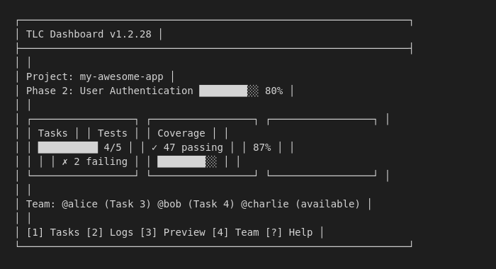

# TLC Documentation

**Test-Led Coding for Claude Code. Tests before code. Automatically.**

---

## Start Here

| Your Experience | Start With |
|-----------------|------------|
| **Never coded before?** | [Noob Guide](noob) - Complete setup from zero |
| **Know how to code?** | [Skip Manual - Start](skip-manual-start) - 30-second setup |

---

## Quick Links

| Getting Started | Reference | Tutorials |
|-----------------|-----------|-----------|
| [Noob Guide](noob) | [All Commands](command-reference) | [Solo Developer](solo-developer) |
| [Quick Start](skip-manual-start) | [Configuration](configuration) | [Team Setup](team-setup) |
| [Core Workflow](getting-started) | [Troubleshooting](troubleshooting) | |

## What is TLC?

TLC enforces test-first development with AI coding assistants:

```
You describe → Tests written → Code implemented → Tests pass → Done
```

No manual testing. No "does this work?" No vibes.

**New:** Just run `/tlc:next` - it figures out what's next and executes automatically.



## Installation

```bash
npm install -g tlc-claude-code
tlc
```

## Core Commands

| Command | Description |
|---------|-------------|
| `/tlc` | Smart entry point - shows dashboard and status |
| `/tlc:next` | **Action-oriented** - shows what's next, asks once, then executes |
| `/tlc:plan` | Plan a phase |
| `/tlc:build` | Build phase (test-first, auto-parallelizes with model selection) |
| `/tlc:verify` | Human verification |
| `/tlc:status` | Check test status |

**New in v1.8.1:** `/tlc:build` now automatically parallelizes independent tasks with Opus 4.6 model selection (opus/sonnet/haiku per task complexity). No flags needed.

## For Teams

| Command | Description |
|---------|-------------|
| `/tlc:claim` | Claim a task |
| `/tlc:who` | See team status |
| `/tlc:bug` | Report a bug |
| `tlc init` | Set up dev server |

## Enterprise Features (v1.4+)

| Command | Description |
|---------|-------------|
| `/tlc:workspace` | Multi-repo workspace management |
| `/tlc:audit` | Audit logging with SIEM export |
| `/tlc:retention` | Zero-data-retention mode |
| `/tlc:sso` | SSO (OAuth/SAML) integration |
| `/tlc:compliance` | SOC 2 compliance tooling |

Enterprise features are opt-in and don't affect non-enterprise users.

## Documentation

### Wiki

- [Getting Started](getting-started) - Installation and first steps
- [Command Reference](command-reference) - All commands explained
- [Configuration](configuration) - `.tlc.json` options
- [Troubleshooting](troubleshooting) - Common issues and fixes

### Tutorials

- [Solo Developer](solo-developer) - Complete workflow for individuals
- [Team Setup](team-setup) - Guide for teams (3+ engineers)

### Guides

- [Team Workflow](team-workflow) - Role-based collaboration guide
- [Dev Server](devserver) - Deploy TLC dev server
- [Kubernetes Deployment](kubernetes-deployment) - Deploy on K8s

## Philosophy

**Tests define behavior. Code makes tests pass.**

- Tests written BEFORE code
- Untested code gets flagged
- Coverage gaps get prioritized
- Human verification still happens

## Support

- [GitHub Issues](https://github.com/jurgencalleja/TLC/issues) - Report bugs
- [GitHub Discussions](https://github.com/jurgencalleja/TLC/discussions) - Ask questions

## License

MIT
