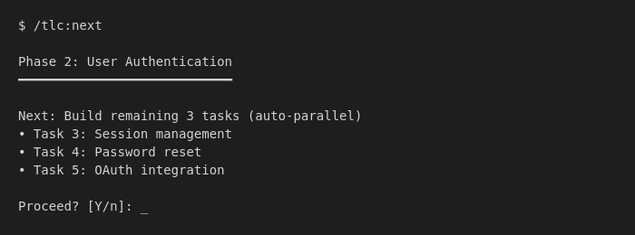

# Complete Beginner Guide

**Never coded before? Coming from Replit? This is your starting point.**

---

## What You Need

Before using TLC, you need to set up your computer for coding:

| Tool | What It Is | Time to Install |
|------|-----------|-----------------|
| VS Code | Where you write code | 5 min |
| GitHub Desktop | Saves and shares your code (visual git) | 5 min |
| Node.js | Runs JavaScript | 5 min |
| Docker Desktop | Runs apps in containers | 10 min |
| Claude Code | AI that helps you code | 5 min |
| TLC | Makes sure your code works | 2 min |

**Windows only:** Also need WSL 2 (10 min)

**Total setup time: ~30-40 minutes**

### Docker Desktop (Required)

TLC uses Docker to run your app in isolated containers. **Docker is required for full TLC functionality** including dev server, live preview, log streaming, and team dashboards.

**Windows users:** Install WSL 2 first (Docker Desktop needs it).

**Install WSL 2 (Windows only):**
1. Open PowerShell as Administrator
2. Run: `wsl --install`
3. Restart your computer
4. Set up a Linux username/password when prompted

**Install Docker Desktop (Mac & Windows):**
1. Go to https://www.docker.com/products/docker-desktop
2. Download and install
3. Windows: Enable WSL 2 backend in Docker settings
4. Start Docker Desktop

**Learn more:** [Docker Desktop Installation](https://docs.docker.com/desktop/)

---

## Step-by-Step Setup

### 1. Install VS Code (Your Editor)

VS Code is where you'll write all your code.

1. Go to https://code.visualstudio.com
2. Click the big download button
3. Run the installer
4. Open VS Code when done

**Learn more:** [VS Code Basics](https://code.visualstudio.com/docs/introvideos/basics)

---

### 2. Install GitHub Desktop (Track Your Code)

GitHub Desktop gives you a visual way to save and share your code — no command line needed.

1. Go to https://desktop.github.com
2. Download and install
3. Sign in with your GitHub account (create one free at https://github.com if needed)

**Why GitHub Desktop?**
- Visual interface — see your changes clearly
- One-click commits — no commands to memorize
- Easy sync — push/pull with buttons
- Beginner-friendly — learn git concepts without the command line

**Learn more:** [GitHub Desktop Docs](https://docs.github.com/en/desktop)

---

### 3. Install Node.js (Run JavaScript)

Node.js lets you run JavaScript on your computer.

1. Go to https://nodejs.org
2. Download the **LTS** version (the safer option)
3. Run the installer

**Test it works:**
```
node --version
npm --version
```

**Learn more:** [Node.js Introduction](https://nodejs.dev/en/learn/)

---

### 4. Install Claude Code (Your AI Assistant)

Claude Code is the AI that helps you write code.

**Requirements:** You need either:
- Claude Max subscription ($20/month), OR
- Anthropic API key (pay per use)

**Install it:**
```
npm install -g @anthropic-ai/claude-code
```

**Start it:**
```
claude
```

First time will ask you to log in.

**Learn more:** [Claude Code Documentation](https://docs.anthropic.com/claude-code)

---

### 5. Install TLC (Test-Led Coding)

TLC makes sure your code actually works.

```
npx tlc-claude-code --global
```

**Test it works:**
In Claude Code, type:
```
/tlc:help
```

---

## Your First Project

Now let's build something!

### Create a Project Folder

**Using GitHub Desktop:**
1. Open GitHub Desktop
2. File → New Repository
3. Name: `my-first-app`
4. Choose where to save it
5. Click "Create Repository"
6. Click "Open in Visual Studio Code"

**Or using terminal:**
```
mkdir my-first-app
cd my-first-app
git init
```

### Start TLC

In Claude Code:
```
/tlc:new-project
```

Answer the questions:
- **What are you building?** "A simple to-do list app"
- **Who uses it?** "Just me"
- **Any constraints?** "None"

TLC will set everything up for you.

### Build Your First Feature

```
/tlc:next
```

This is the easiest command. It:
1. Figures out what to do next
2. Shows you briefly what it will do
3. Asks "Proceed? [Y/n]"
4. On Enter → just does it

That's it! Just keep running `/tlc:next` and your project builds itself.

<!-- TODO: Add screenshot of /tlc:next in action -->
<!--  -->

---

## Essential Commands

### Terminal (where you type commands)

| Command | What It Does |
|---------|--------------|
| `cd folder` | Go into a folder |
| `cd ..` | Go back one folder |
| `ls` (Mac/Linux) or `dir` (Windows) | List files |
| `mkdir name` | Create a folder |

### Git (save your work)

**With GitHub Desktop (recommended for beginners):**
| Action | How |
|--------|-----|
| See changes | Look at the "Changes" tab |
| Save changes | Type a message, click "Commit to main" |
| Share online | Click "Push origin" |

**With terminal (advanced):**
| Command | What It Does |
|---------|--------------|
| `git add .` | Prepare all changes to save |
| `git commit -m "message"` | Save changes with a note |
| `git status` | See what changed |

### TLC (build software)

| Command | What It Does |
|---------|--------------|
| `/tlc:next` | **Easiest!** Just does the next thing |
| `/tlc` | See full dashboard |
| `/tlc:build` | Build the current phase (runs multiple tasks in parallel!) |
| `/tlc:verify` | Test your work |

---

## Common Mistakes (and Fixes)

### "command not found"

The program isn't installed or your computer can't find it.

**Fix:** Close and reopen VS Code, then try again.

### "permission denied"

You don't have access to do something.

**Fix (Mac/Linux):** Add `sudo` before the command
**Fix (Windows):** Run VS Code as administrator

### "npm ERR!"

Something went wrong with npm.

**Fix:** Try running `npm cache clean --force` then try again.

### Code doesn't run

Make sure you saved the file (Ctrl+S / Cmd+S).

---

## Glossary

| Term | Meaning |
|------|---------|
| **Terminal** | The text box where you type commands |
| **Repository (repo)** | A project folder tracked by Git |
| **Commit** | A saved snapshot of your code |
| **npm** | Tool that installs JavaScript packages |
| **Package** | Code someone else wrote that you can use |
| **Test** | Code that checks if other code works |
| **TDD** | Test-Driven Development - write tests first |

---

## What's Next?

1. **Build something small** - Start with `/tlc:new-project`
2. **Learn GitHub Desktop** - [GitHub Desktop Guide](https://docs.github.com/en/desktop/overview/getting-started-with-github-desktop)
3. **Learn JavaScript** - Try https://javascript.info
4. **Join a community** - Discord, Reddit r/learnprogramming

---

## Getting Help

Stuck? Here's where to get help:

- **TLC Issues:** Ask on [GitHub](https://github.com/jurgencalleja/TLC/issues)
- **Claude Code:** Check [Anthropic Docs](https://docs.anthropic.com)
- **General coding:** [Stack Overflow](https://stackoverflow.com)
- **Free learning:** [freeCodeCamp](https://www.freecodecamp.org)

---

**You've got this!** Everyone starts somewhere. Just keep building.
