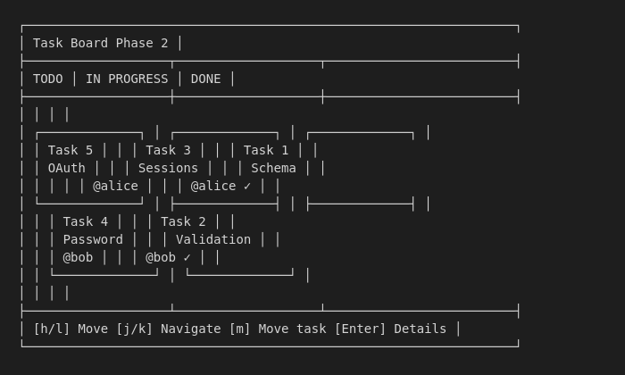

# TLC Team Workflow

## How a Team of 3 Engineers, a Product Owner, and QA Collaborate with TLC

### Executive Summary

TLC (Test-Led Coding) enables teams to use AI coding assistants while maintaining coordination, quality, and visibility. This paper describes how a typical team - three engineers "vibe coding" with Claude Code, a product owner, and a QA team - can work together effectively.

---

## Team Roles

### Engineers (3)

**Tools:** Claude Code with TLC installed

**Responsibilities:**
- Write tests before code (enforced by TLC)
- Claim tasks before starting work
- Push changes frequently
- Fix bugs identified by QA

**Daily Workflow:**
```
1. git pull                    # Get latest
2. /tlc:next                   # See what's next, proceed? [Y/n]
   OR
2. /tlc:progress               # See project state
3. /tlc:who                    # Check team activity
4. /tlc:claim 2                # Claim a task
5. /tlc:build                  # Write tests, implement (auto-parallel!)
6. git push                    # Share progress
7. /tlc:release (if blocked)   # Release if switching
```

**New:** `/tlc:build` auto-parallelizes independent tasks (up to 10 agents). No configuration needed.

### Product Owner (1)

**Tools:** Web browser (TLC Dashboard), issue tracker

**Responsibilities:**
- Define requirements in issue tracker
- Review progress on dashboard
- Prioritize bugs
- Accept completed features

**Daily Workflow:**
```
1. Open TLC Dashboard          # http://localhost:3147
2. Review phase progress       # See % complete
3. Check open bugs             # Prioritize fixes
4. Create new issues           # Define next requirements
5. Review completed tasks      # Accept or request changes
```

### QA Team

**Tools:** Web browser (TLC Dashboard), the application

**Responsibilities:**
- Test features as they're completed
- Submit bugs via dashboard
- Verify bug fixes
- Sign off on releases

**Daily Workflow:**
```
1. Open TLC Dashboard          # http://localhost:3147
2. Watch for "ready to verify" # Tasks marked complete
3. Test the feature            # Manual + exploratory
4. Submit bugs (if found)      # Via web form
5. Verify fixes                # Re-test after fix
6. Mark verified               # In dashboard
```

---

## The TLC Coordination Model

### How Tasks Flow

```
┌─────────────┐    ┌─────────────┐    ┌─────────────┐    ┌─────────────┐
│   ROADMAP   │───▶│    PLAN     │───▶│    BUILD    │───▶│   VERIFY    │
│  (phases)   │    │   (tasks)   │    │ (test-first)│    │    (QA)     │
└─────────────┘    └─────────────┘    └─────────────┘    └─────────────┘
      │                  │                  │                  │
      │                  │                  │                  │
      ▼                  ▼                  ▼                  ▼
   PO defines        Claude plans      Engineers claim     QA tests
   priorities        with tests        and implement       and reports
```

### Preventing Conflicts

**Problem:** Two engineers claim the same task, duplicate work.

**Solution:** Git-based task markers with commit/push protocol.

```markdown
# In PLAN.md

### Task 2: Add validation [ ]           ← Alice sees available
### Task 2: Add validation [>@alice]     ← After Alice claims
### Task 2: Add validation [>@bob]       ← Bob's claim fails (conflict)
```

**Workflow:**
1. Engineer runs `/tlc:claim 2`
2. TLC does `git pull` first
3. TLC updates marker: `[ ]` → `[>@alice]`
4. TLC commits and pushes
5. If push fails (someone else pushed), TLC aborts and shows conflict

### Handling Blocked Tasks

**Problem:** Engineer is blocked, task sits claimed.

**Solution:** `/tlc:release` and bug logging.

```
> /tlc:release 2

Releasing task 2: Add validation

Reason?
1) Blocked by dependency
2) Switching to higher priority
3) Need more information
4) End of day
> 1

What's blocking you?
> Task 2 depends on Task 1 which isn't done yet

Creating bug/blocker: "Task 2 blocked by Task 1"
Released: [>@alice] → [ ]
```

---

## A Day in the Life

### 9:00 AM - Team Standup (Optional with TLC)

With TLC, standups become optional because everyone can see status:

```
> /tlc:who

Phase 2: Authentication

Team Activity:
  @alice: Task 1 (done), Task 3 (working)
  @bob: Task 2 (working)
  @charlie: (no tasks claimed)

Open bugs: 2
  BUG-007: High - Login fails with + symbol
  BUG-008: Low - Button color mismatch
```

### 9:15 AM - Engineer Alice Continues Work

```
> /tlc:progress

Phase 2: Authentication

Tasks: ██████░░░░ 3/5 complete

  [x@alice] 1. Create user schema
  [>@bob]   2. Add validation (bob is working)
  [>@alice] 3. Session management (you, in progress)
  [ ]       4. Password reset
  [ ]       5. OAuth integration

Tests: 24 passing | 3 failing (your task)

Continue with /tlc:build 2
```

### 10:30 AM - Engineer Bob Finishes Task 2

```
> /tlc:build 2

All tests passing!

Task 2: Add validation [>@bob] → [x@bob]

Committed: feat: email validation - phase 2 (@bob)
Committed: complete: task 2 - Add validation (@bob)

Pushed to origin/main

Ready for QA verification.
```

### 11:00 AM - QA Sees Task Ready

QA opens dashboard, sees tasks ready for verification:

<!-- TODO: Add dashboard screenshot -->
<!--  -->

```
╭─────────────────────────────────────────╮
│  Ready for Verification                 │
├─────────────────────────────────────────┤
│  Task 2: Add validation (@bob)          │
│  Completed: 10:30 AM                    │
│  Tests: 8 passing                       │
│                                         │
│  [Start Testing]                        │
╰─────────────────────────────────────────╯
```

### 11:30 AM - QA Finds Bug

QA tests email validation, finds edge case:

```
BUG SUBMISSION (via web form)

What's the issue?
> Email with consecutive dots (test..email@example.com) is accepted but shouldn't be

Severity: Medium

Steps to reproduce:
> 1. Enter email: test..email@example.com
> 2. Click validate
> 3. Email is accepted

[Submit]
```

Dashboard shows bug immediately. Bob gets notification.

### 11:45 AM - Bob Fixes Bug

```
> /tlc:bug --list

BUG-009: Medium - Email with consecutive dots accepted
  Reporter: @qa-team
  Task: Task 2 - Add validation
  Status: Open

Fix this bug? (Y/n) y

Writing test for BUG-009...
  ✗ test: rejects email with consecutive dots (failing - expected)

Implementing fix...
  ✓ test: rejects email with consecutive dots (passing)

Committed: fix: BUG-009 - reject consecutive dots in email (@bob)

Mark as fixed? (Y/n) y
BUG-009: Open → Fixed
```

### 12:00 PM - QA Verifies Fix

QA sees in dashboard:

```
BUG-009: Email with consecutive dots accepted
Status: Fixed (awaiting verification)

[Verify Fix]
```

QA re-tests, confirms fix works:

```
BUG-009: Fixed → Verified
```

### 2:00 PM - Product Owner Reviews Progress

PO opens dashboard, sees:

```
╭─────────────────────────────────────────╮
│  Phase 2: Authentication                │
│  Progress: ████████░░ 4/5 tasks         │
│                                         │
│  Completed today: 2                     │
│  Bugs fixed: 1                          │
│  Open bugs: 1 (low severity)            │
│                                         │
│  Estimated completion: Tomorrow         │
╰─────────────────────────────────────────╯
```

---

## Communication Patterns

### When to Use What

| Scenario | Tool |
|----------|------|
| "What should I work on?" | `/tlc:next` or `/tlc:progress` |
| "I'm starting task 3" | `/tlc:claim 3` |
| "I'm blocked" | `/tlc:release` + `/tlc:bug` |
| "I found an issue" | `/tlc:bug` or Dashboard form |
| "What's the team doing?" | `/tlc:who` or Dashboard |
| "Is the feature done?" | Dashboard (PO/QA view) |

### Reducing Slack/Meeting Overhead

TLC artifacts replace many sync communications:

| Before TLC | With TLC |
|------------|----------|
| "What are you working on?" | `/tlc:who` |
| "Is task 2 done?" | Dashboard shows completion |
| "I found a bug" | Bug appears in BUGS.md instantly |
| "Can someone review?" | Task marked complete → QA notified |
| "What's blocking you?" | Release reason in git log |

---

## Best Practices

### For Engineers

1. **Always pull before claiming**
   ```
   git pull && /tlc:claim 2
   ```

2. **Push frequently** - Don't let claims go stale

3. **Release if blocked** - Don't hoard tasks

4. **Write descriptive test names** - QA reads them
   ```
   ✓ "user can login with valid credentials"
   ✗ "test login"
   ```

5. **One task at a time** - Finish before claiming another

### For Product Owners

1. **Check dashboard daily** - Not just standups

2. **Prioritize bugs promptly** - Engineers wait on direction

3. **Define acceptance criteria** - In issue descriptions

4. **Trust the tests** - If tests pass, feature works as specified

### For QA

1. **Test as tasks complete** - Don't batch at end

2. **Use the web form** - Bugs are tracked automatically

3. **Include reproduction steps** - Engineers need them

4. **Verify promptly** - Unblocks engineers

5. **Test edge cases** - The tests might miss some

---

## Onboarding New Team Members

### Engineer Onboarding (30 minutes)

1. Install Claude Code
2. Run `npx tlc-claude-code` to install TLC
3. Clone the project repo
4. Run `/tlc:progress` to see state
5. Run `/tlc:who` to see team
6. Claim a small task: `/tlc:claim`
7. Complete it: `/tlc:build`

### PO/QA Onboarding (15 minutes)

1. Get dashboard URL from engineer
2. Open in browser
3. Bookmark it
4. Learn the bug submission form
5. Done!

---

## Troubleshooting

### "I claimed a task but it shows as available"

You forgot to push. Run:
```
git push
```

### "Two people claimed the same task"

Git conflict. The second person should:
```
git pull --rebase
# Resolve conflict in PLAN.md
git push
```

### "QA can't access dashboard"

They need to be on same network. Options:
1. Use your local IP: `http://192.168.1.x:3147`
2. Use ngrok for remote: `ngrok http 3147`

### "Tests pass but feature is broken"

Tests are incomplete. Log a bug, add more tests:
```
/tlc:bug "Feature X doesn't handle case Y"
# Then add test for case Y
```

---

## Metrics to Track

| Metric | Target | Why |
|--------|--------|-----|
| Claim conflicts | <5% | Shows coordination is working |
| Bug escape rate | <10% | Tests are catching issues |
| Time claim→complete | <4 hours | Tasks are right-sized |
| Bug fix time | <24 hours | QA feedback loop is fast |
| Test coverage | >80% | Quality baseline |

---

## Summary

TLC enables teams to "vibe code" with AI while maintaining:

- **Coordination** - Task claiming prevents duplicated work
- **Quality** - Test-first ensures features work as specified
- **Visibility** - Dashboard shows everyone the same truth
- **Speed** - Bugs are logged and fixed in the same flow

The key insight: **git is the coordination mechanism**. Task claims, completions, and bugs all flow through git, so everyone stays in sync automatically.
